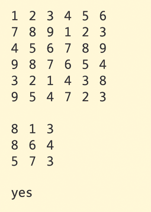

## Input
```
rowA colA
rowB colB
rowA * colA numbers for matrix A (row by row)
rowB * colB numbers for matrix B (row by row)
```
## Output
Prints exactly:

yes or no

Example:

Input:
```
6 6
3 3
1 2 3 4 5 6
7 8 9 1 2 3
4 5 6 7 8 9
9 8 7 6 5 4
3 2 1 4 3 8
9 5 4 7 2 3
8 1 3
8 6 4
5 7 3
```

Output:
```
yes
```



